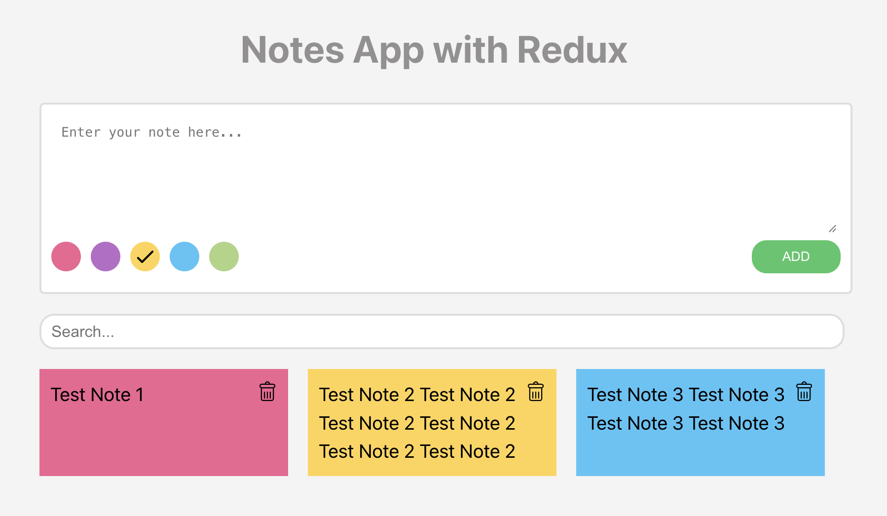

Bu uygulama client ve server olarak iki modülden oluşur.

**server** => NodeJS ile yazılmıştır. Notlarınızı lokalde notes.json isimli bir dosyada tutar. 4000 portunda çalışır. İsterseniz server.js dosyasının 7. satırından bu ayarı değiştirebilirsiniz.

Server'i çalıştırmak için komut satırında ```node server``` demeniz yeterlidir.

**client** => Bir react uygulamasıdır. Backend olarak *4000* portunda çalışan server uygulamasını kullanır. Eğer backend uygulamasını port numarasını değiştirir iseniz veya farklı bir backend kullanmak isterseniz ```src/redux/noteSlices.js``` dosyasının 3. satırında bunu değiştirmeniz gerekir. Yükleme sorunu olmasın diye ben kod içine yazdım. Ancak siz kullanırken ```.env``` dosyasına taşıyabilir ve ```process.env.REACT_APP_BACKEND_API``` şeklinde de kullanabilirsiniz.

